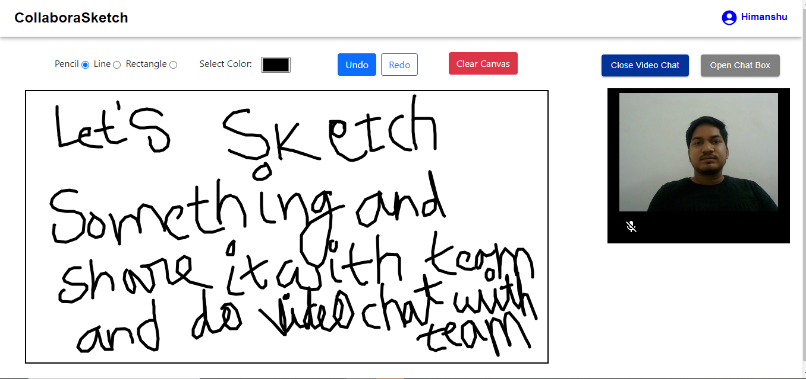

# Installation Guide
1. Download or Clone this repo
2. Unzip the repo (if downloaded)
3. Open cmd or terminal under root project folder.
4. Move to backend folder and type command `yarn` to install all dependencies in backend
5. Move to frontend folder and type command `yarn` to install all dependencies in frontend

# Run development servers
1. Backend:-
  - open backend directory in terminal or cmd and type `yarn start` to run development server
  
2. Frontend:-
  - open frontend directory in terminal or cmd and type `yarn dev` to run development server

Video call screen

Chat screen

